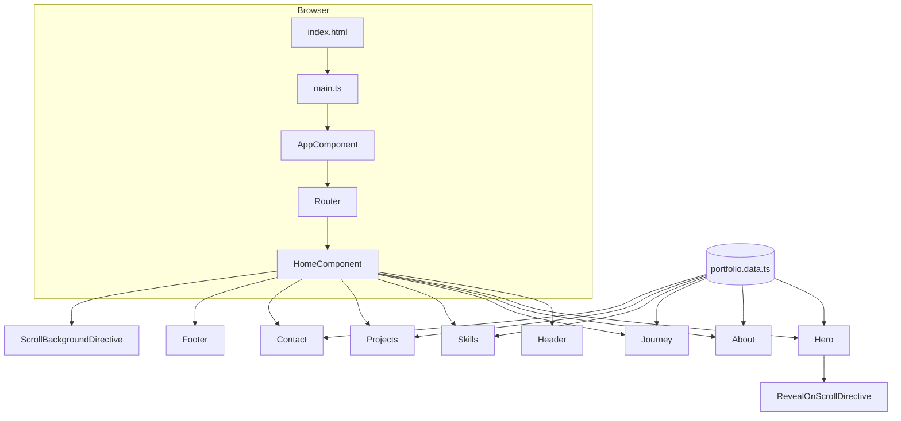

# Portfolio Website Tutorial — Zero to Hero

A complete walkthrough of building this professional Angular portfolio: from an empty folder to a polished single-page site with scroll effects, animations, and content driven by your CV.

---

## Table of contents

1. [What you will build](#1-what-you-will-build)
2. [Prerequisites](#2-prerequisites)
3. [Project layout](#3-project-layout)
4. [Phase 1 — Create the Angular app from scratch](#4-phase-1--create-the-angular-app-from-scratch)
5. [Phase 2 — Architecture overview](#5-phase-2--architecture-overview)
6. [Phase 3 — Centralize your content (data layer)](#6-phase-3--centralize-your-content-data-layer)
7. [Phase 4 — Global design system](#7-phase-4--global-design-system)
8. [Phase 5 — Build the page shell (routing + home)](#8-phase-5--build-the-page-shell-routing--home)
9. [Phase 6 — Section components (zero to hero UI)](#9-phase-6--section-components-zero-to-hero-ui)
10. [Phase 7 — Custom directives (scroll magic)](#10-phase-7--custom-directives-scroll-magic)
11. [Phase 8 — Run, build, and deploy](#11-phase-8--run-build-and-deploy)
12. [Customization cheat sheet](#12-customization-cheat-sheet)
13. [Troubleshooting](#13-troubleshooting)
14. [Next steps](#14-next-steps)

---

## 1. What you will build

A **single-page portfolio** that runs locally and includes:

| Section | Purpose |
|--------|---------|
| **Header** | Fixed navigation, smooth scroll to sections, mobile menu |
| **Hero** | Name, title, tagline, CTAs, quick stats, scroll indicator |
| **About** | Bio, education, languages |
| **Career journey** | Vertical timeline of roles |
| **Skills** | Grouped tech stack chips |
| **Projects** | Personal GitHub projects with links |
| **Contact** | Email, GitHub, location |
| **Footer** | Copyright and back-to-top |

**Design direction:** enterprise meets edgy — dark theme, cyan/violet accents, subtle grid and noise, scroll-driven background darkening, and reveal-on-scroll animations.

**Tech stack:** Angular 19, standalone components, SCSS, TypeScript, no backend (static content).

---

## 2. Prerequisites

Install these before you start:

| Tool | Version (used in this project) | Check with |
|------|-------------------------------|------------|
| **Node.js** | 18+ (20+ recommended) | `node -v` |
| **npm** | 9+ | `npm -v` |
| **Angular CLI** | 19.x (optional; `npx` works too) | `npx ng version` |

**Helpful knowledge (not required):**

- Basic HTML/CSS
- TypeScript basics
- Very basic Angular (components, templates, `@for`)

**Source material:** `CV.pdf` in the repo root — all copy (experience, skills, projects) was extracted from there into `portfolio.data.ts`.

---

## 3. Project layout

```
portfolio/
├── CV.pdf                    # Your résumé (source of truth for copy)
├── README.md                 # Quick start
├── tutorial.md               # This file
└── portfolio-site/           # Angular application
    ├── angular.json          # Build & serve config
    ├── package.json          # Dependencies & scripts
    ├── public/               # Static assets (favicon)
    └── src/
        ├── index.html        # Page shell, meta tags, fonts
        ├── styles.scss       # Global variables, utilities, reveal classes
        ├── main.ts           # Bootstraps the app
        └── app/
            ├── app.component.ts      # Root: only <router-outlet />
            ├── app.config.ts         # Router + zone config
            ├── app.routes.ts         # Routes → HomeComponent
            ├── data/
            │   └── portfolio.data.ts # All text & structured content
            ├── directives/
            │   ├── reveal-on-scroll.directive.ts
            │   └── scroll-background.directive.ts
            ├── pages/
            │   └── home/             # Composes all sections
            └── components/
                ├── header/
                ├── hero/
                ├── about/
                ├── journey/
                ├── skills/
                ├── projects/
                ├── contact/
                └── footer/
```

**Design principle:** content lives in **one data file**; UI lives in **small section components**; behavior lives in **directives**.

---

## 4. Phase 1 — Create the Angular app from scratch

If you were starting today with an empty `portfolio` folder:

### Step 1.1 — Scaffold the project

```bash
cd portfolio
npx @angular/cli@19 new portfolio-site --routing --style=scss --ssr=false --skip-git --defaults
cd portfolio-site
```

| Flag | Why |
|------|-----|
| `--routing` | Enables `app.routes.ts` for future pages |
| `--style=scss` | SCSS for variables, nesting, component styles |
| `--ssr=false` | Simple static SPA for local/portfolio hosting |
| `--defaults` | Skips interactive prompts |

### Step 1.2 — Verify it runs

```bash
npm start
```

Open **http://localhost:4200**. You should see the default Angular welcome page.

### Step 1.3 — Clean the default template

Replace the bloated `app.component.html` with a minimal root:

```typescript
// app.component.ts
@Component({
  selector: 'app-root',
  imports: [RouterOutlet],
  template: '<router-outlet />',
  styles: ':host { display: block; }',
})
export class AppComponent {}
```

Delete `app.component.html` and `app.component.scss` if they exist.

---

## 5. Phase 2 — Architecture overview

This app is a **single route** that renders one page made of sections:



**Data flow:**

1. `portfolio.data.ts` exports `PORTFOLIO` constant.
2. Each section component imports `PORTFOLIO` and binds fields in its template.
3. Directives add scroll behavior without polluting templates with logic.

**Why standalone components?** Angular 19 defaults to standalone — no `NgModule` per feature. Each component lists its own `imports: [...]`.

---

## 6. Phase 3 — Centralize your content (data layer)

Create `src/app/data/portfolio.data.ts` so you never hunt through HTML to change copy.

### Step 3.1 — Define TypeScript interfaces

```typescript
export interface CareerEntry {
  period: string;
  role: string;
  company: string;
  location: string;
  highlights: string[];
  type: 'work' | 'freelance' | 'intern';
}

export interface EducationEntry {
  period: string;
  degree: string;
  institution: string;
}

export interface ProjectEntry {
  title: string;
  url: string;
  description: string;
  tags: string[];
}

export interface SkillGroup {
  label: string;
  items: string[];
}
```

Interfaces give autocomplete and catch typos when you edit career entries.

### Step 3.2 — Export one `PORTFOLIO` object

```typescript
export const PORTFOLIO = {
  name: 'Andrias Simić',
  title: 'Full Stack Developer',
  tagline: '...',
  email: 'simic.andria06@gmail.com',
  github: 'https://github.com/AirDNA6',
  location: 'Belgrade, Serbia',
  about: `Multi-paragraph bio...`,
  career: [ /* CareerEntry[] */ ],
  education: [ /* EducationEntry[] */ ],
  languages: [ { name: 'Serbian', level: 'Native' }, ... ],
  skillGroups: [ /* SkillGroup[] */ ],
  projects: [ /* ProjectEntry[] */ ],
  navLinks: [
    { id: 'about', label: 'About' },
    { id: 'journey', label: 'Journey' },
    // ...
  ],
};
```

**Tip:** Map each block of `CV.pdf` to a property. When you update your CV, update this file first, then skim the site.

### Step 3.3 — Use data in a component

```typescript
import { PORTFOLIO } from '../../data/portfolio.data';

export class HeroComponent {
  readonly portfolio = PORTFOLIO;
}
```

```html
<h1>{{ portfolio.name }}</h1>
<p>{{ portfolio.tagline }}</p>
```

---

## 7. Phase 4 — Global design system

All shared visual rules live in `src/styles.scss`.

### Step 4.1 — CSS custom properties (design tokens)

```scss
:root {
  --bg-deep: #06080f;           /* Darkest — after scroll */
  --bg-hero: #161e30;           /* Lighter — top of page */
  --scroll-progress: 0;         /* 0–1, set by directive */
  --surface-elevated: #0c1018;
  --text-primary: #f4f4f5;
  --text-muted: #94a3b8;
  --accent-cyan: #38bdf8;
  --accent-violet: #818cf8;
  --font-display: 'Plus Jakarta Sans', system-ui, sans-serif;
  --font-body: 'IBM Plex Sans', system-ui, sans-serif;
}
```

Load fonts in the same file (or `index.html`):

```scss
@import url('https://fonts.googleapis.com/css2?family=IBM+Plex+Sans:...&family=Plus+Jakarta+Sans:...');
```

**Font note:** Headings use **Plus Jakarta Sans** (clean, not stretched). Body uses **IBM Plex Sans**.

### Step 4.2 — Layout utilities

```scss
.container {
  max-width: 72rem;
  margin: 0 auto;
  padding: 0 clamp(1.25rem, 4vw, 2rem);
}

.section {
  padding: clamp(4rem, 10vw, 6rem) 0;
}

.section-title { /* shared h2 styling */ }
.btn { /* primary & ghost buttons */ }
```

### Step 4.3 — Scroll-driven background (CSS side)

The **lighter** base is `body` background. A **fixed overlay** darkens as you scroll:

```scss
body {
  background: var(--bg-hero);
}

body::after {
  content: '';
  position: fixed;
  inset: 0;
  z-index: -2;
  background: var(--bg-deep);
  opacity: var(--scroll-progress);  /* Updated by ScrollBackgroundDirective */
  pointer-events: none;
}

body::before {
  /* Subtle noise texture on top */
  z-index: -1;
}
```

The directive sets `--scroll-progress` from `0` (top) to `1` (~1 viewport of scrolling). No JavaScript changes individual sections — one variable controls the whole page mood.

### Step 4.4 — Reveal animation classes

```scss
.reveal-hidden {
  opacity: 0;
  transform: translateY(28px);
  transition: opacity 0.7s ..., transform 0.7s ...;
}

.reveal-visible {
  opacity: 1;
  transform: translateY(0);
}
```

Components add `appRevealOnScroll` to elements; the directive toggles these classes when they enter the viewport.

---

## 8. Phase 5 — Build the page shell (routing + home)

### Step 5.1 — Routes

`src/app/app.routes.ts`:

```typescript
import { Routes } from '@angular/router';
import { HomeComponent } from './pages/home/home.component';

export const routes: Routes = [
  { path: '', component: HomeComponent },
  { path: '**', redirectTo: '' },
];
```

### Step 5.2 — App config

`src/app/app.config.ts` wires the router:

```typescript
export const appConfig: ApplicationConfig = {
  providers: [
    provideZoneChangeDetection({ eventCoalescing: true }),
    provideRouter(routes),
  ],
};
```

### Step 5.3 — Home page composes sections

`home.component.html`:

```html
<app-header />
<main>
  <app-hero />
  <app-about />
  <app-journey />
  <app-skills />
  <app-projects />
  <app-contact />
</main>
<app-footer />
```

`home.component.ts` imports every section component and attaches scroll behavior:

```typescript
@Component({
  selector: 'app-home',
  standalone: true,
  hostDirectives: [ScrollBackgroundDirective],
  imports: [
    HeaderComponent,
    HeroComponent,
    AboutComponent,
    // ...
  ],
})
export class HomeComponent {}
```

`hostDirectives` applies `ScrollBackgroundDirective` to the `<app-home>` element’s lifecycle — no extra DOM node.

### Step 5.4 — Section IDs for navigation

Each section needs a matching `id` for header links:

| Nav label | Element `id` |
|-----------|----------------|
| About | `about` |
| Journey | `journey` |
| Skills | `skills` |
| Projects | `projects` |
| Contact | `contact` |
| Hero (top) | `hero` |

Header scroll helper:

```typescript
scrollTo(id: string): void {
  document.getElementById(id)?.scrollIntoView({ behavior: 'smooth', block: 'start' });
}
```

Add `scroll-padding-top: 5rem` on `html` so content isn’t hidden under the fixed header.

---

## 9. Phase 6 — Section components (zero to hero UI)

Generate each component (or create files manually):

```bash
ng generate component components/hero --standalone --skip-tests
```

Below is what each section does and the key ideas to replicate.

---

### 9.1 Header (`app-header`)

**Responsibilities:**

- Fixed top bar; glass background when `window.scrollY > 24`
- Nav buttons call `scrollTo(sectionId)`
- Mobile hamburger toggles full-screen menu
- “Get in touch” → `mailto:` link

**Pattern — signals for UI state:**

```typescript
readonly menuOpen = signal(false);
readonly scrolled = signal(false);

@HostListener('window:scroll')
onScroll(): void {
  this.scrolled.set(window.scrollY > 24);
}
```

**Avoid in templates:** arrow functions like `(click)="menuOpen.update(v => !v)"` — Angular templates don’t parse them. Use a method: `toggleMenu()`.

---

### 9.2 Hero (`app-hero`) — the “zero to hero” centerpiece

**Structure:**

1. Decorative layer: CSS grid + blurred gradient orbs (`aria-hidden="true"`)
2. Content: eyebrow badge → `h1` (name + title gradient) → tagline → buttons → stats row
3. Scroll hint: “Scroll” + animated line **below** stats (in document flow, not `position: absolute` over stats)

**Stats row example:**

```html
<div class="hero__stats">
  <div class="hero__stat">
    <span class="hero__stat-value">5+</span>
    <span class="hero__stat-label">Years in tech</span>
  </div>
  <!-- .NET, Belgrade, etc. -->
</div>
```

**Hero layout (flex column):**

```scss
.hero {
  min-height: 100vh;
  display: flex;
  flex-direction: column;
  justify-content: center;
}

.hero__scroll {
  align-self: center;
  margin-top: 3rem;  /* Prevents overlap with stats */
}
```

Use `appRevealOnScroll` on headline blocks for staggered entrance.

---

### 9.3 About (`app-about`)

- Split layout: bio paragraphs (left) + cards for education & languages (right)
- Split `portfolio.about` on `\n\n` for multiple `<p>` tags:

```typescript
readonly aboutParagraphs = PORTFOLIO.about.split('\n\n').filter(Boolean);
```

```html
@for (paragraph of aboutParagraphs; track $index) {
  <p>{{ paragraph }}</p>
}
```

---

### 9.4 Journey (`app-journey`) — career timeline

- Vertical line via `::before` on `.journey__timeline`
- Each `CareerEntry` is a card with period, badge (`work` / `freelance` / `intern`), role, company, bullet highlights
- First item styled as “current” (`.journey__item--current`)

```html
@for (entry of portfolio.career; track entry.company + entry.period; let i = $index) {
  <article [class.journey__item--current]="i === 0">
    ...
  </article>
}
```

---

### 9.5 Skills (`app-skills`)

- Grid of cards; each `SkillGroup` has a label + flex-wrapped chips
- Hover state on chips for subtle interactivity

---

### 9.6 Projects (`app-projects`)

- Cards are `<a>` tags linking to GitHub
- `@for` over `portfolio.projects` with index display `01`, `02`
- External links: `target="_blank"` and `rel="noopener noreferrer"`

---

### 9.7 Contact & Footer

- Contact: centered panel with glow pseudo-element, email + GitHub + location
- Footer: dynamic year `new Date().getFullYear()`, link to `#hero`

---

## 10. Phase 7 — Custom directives (scroll magic)

### 10.1 `RevealOnScrollDirective` — `[appRevealOnScroll]`

Uses the browser **Intersection Observer API** (efficient; no scroll listeners per element).

**How it works:**

1. On init, add class `reveal-hidden` to the host element.
2. Observe the element; when ~12% visible, add `reveal-visible`, remove `reveal-hidden`.
3. `unobserve` after first reveal (animate once).
4. On destroy, `disconnect()` the observer.

```typescript
this.observer = new IntersectionObserver(
  (entries) => { /* toggle classes */ },
  { threshold: 0.12, rootMargin: '0px 0px -40px 0px' }
);
```

**Usage:**

```html
<h2 class="section-title" appRevealOnScroll>Engineering with intent</h2>
```

Import the directive in the component’s `imports: [RevealOnScrollDirective]`.

---

### 10.2 `ScrollBackgroundDirective` — scroll darkening

**How it works:**

1. Listen to `scroll` and `resize` on `window` (passive listeners = better performance).
2. Throttle updates with `requestAnimationFrame` (one update per frame max).
3. Compute `progress = min(1, scrollY / (innerHeight * 1.15))`.
4. Set `document.documentElement.style.setProperty('--scroll-progress', progress)`.

**Tune the effect:**

| Goal | Change |
|------|--------|
| Darken faster | Lower multiplier (e.g. `0.8 * innerHeight`) |
| Darken slower | Raise multiplier (e.g. `1.5 * innerHeight`) |
| Lighter starting page | Lighten `--bg-hero` in `styles.scss` |
| Darker end state | Darken `--bg-deep` |

Attached via `hostDirectives: [ScrollBackgroundDirective]` on `HomeComponent`.

---

## 11. Phase 8 — Run, build, and deploy

### Development

```bash
cd portfolio-site
npm install    # first time only
npm start      # http://localhost:4200
```

If port 4200 is busy:

```bash
ng serve --port 4201
```

### Production build

```bash
npm run build
```

Output: `portfolio-site/dist/portfolio-site/` — static files ready to host.

### Deploy options (brief)

| Platform | Idea |
|----------|------|
| **GitHub Pages** | Build, push `dist` to `gh-pages` branch or use Actions |
| **Netlify / Vercel** | Connect repo, build command `npm run build`, publish `dist/portfolio-site/browser` (Angular 19 application builder output path — verify after build) |
| **Azure Static Web Apps** | Upload build artifact |

After `ng build`, check the exact folder under `dist/` — Angular’s application builder may use `dist/portfolio-site/browser/`.

### Update `index.html` for production

Set title and meta description (already configured):

```html
<title>Andrias Simić — Full Stack Developer</title>
<meta name="description" content="Portfolio of ..." />
```

---

## 12. Customization cheat sheet

| I want to… | Edit |
|------------|------|
| Change name, job, bio | `src/app/data/portfolio.data.ts` |
| Add a job | Add object to `PORTFOLIO.career[]` |
| Add a project | Add object to `PORTFOLIO.projects[]` |
| Change colors | `:root` variables in `src/styles.scss` |
| Change fonts | Google Fonts `@import` + `--font-display` / `--font-body` |
| Add nav link | `navLinks` in data + new section with matching `id` |
| Disable scroll darkening | Remove `hostDirectives: [ScrollBackgroundDirective]` from home |
| Disable reveal animations | Remove `appRevealOnScroll` from templates |
| Change scroll darkening speed | `scroll-background.directive.ts` → `innerHeight * 1.15` |

### Generate a new section (example: “Certifications”)

```bash
ng generate component components/certifications --standalone --skip-tests
```

1. Add content to `portfolio.data.ts`.
2. Add `<app-certifications />` in `home.component.html`.
3. Import component in `home.component.ts`.
4. Add `{ id: 'certifications', label: 'Certs' }` to `navLinks`.

---

## 13. Troubleshooting

| Problem | Solution |
|---------|----------|
| `Port 4200 is already in use` | Stop other `ng serve` or use `--port 4201` |
| Template error on `(click)="signal.update(...)"` | Use a component method instead of arrow functions in templates |
| Scroll indicator overlaps stats | Keep scroll hint in normal flow with `margin-top`, not `position: absolute` over content |
| Styles budget error on build | In `angular.json`, raise `anyComponentStyle` maximum (already set to 12kB warning) |
| Section hidden under header | Ensure `scroll-padding-top` on `html` |
| Background doesn’t darken | Confirm `ScrollBackgroundDirective` is on `HomeComponent` and `body::after` exists in `styles.scss` |
| Changes not showing | Hard refresh (Ctrl+F5); check you edited `portfolio-site/src`, not root `portfolio/` only |

---

## 14. Next steps

Ideas to extend the portfolio without rewriting the architecture:

1. **Contact form** — Netlify Forms, Formspree, or a small API.
2. **Blog route** — Second route in `app.routes.ts` for articles.
3. **i18n** — Serbian/English toggle using Angular `@angular/localize`.
4. **PDF download** — Link to `CV.pdf` from hero or header.
5. **Theme toggle** — Light/dark via extra CSS variables and a small service.
6. **Analytics** — Plausible or Google Analytics snippet in `index.html`.
7. **Open Graph image** — Meta tags for LinkedIn/Twitter previews.

---

## Quick reference — commands

```bash
# From repo root
cd portfolio-site

npm start          # Dev server
npm run build      # Production build
npm test           # Unit tests (Karma)
ng generate component components/my-section --standalone
```

---

## Summary

You went from **zero** (empty folder + `CV.pdf`) to **hero** (full-viewport intro with stats, gradients, and motion) by:

1. Scaffolding **Angular 19** with standalone components.
2. Centralizing copy in **`portfolio.data.ts`**.
3. Composing **`HomeComponent`** from focused section components.
4. Styling with **CSS variables** and shared utilities in **`styles.scss`**.
5. Adding **`RevealOnScrollDirective`** and **`ScrollBackgroundDirective`** for polish.

The site stays maintainable because content, layout, and behavior are separated — update your CV in one TypeScript file, tweak visuals in SCSS, and ship.

---

*Built for Andrias Simić’s portfolio — Angular 19, enterprise meets edgy.*
